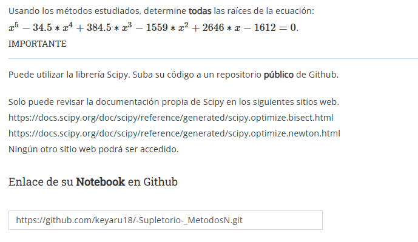
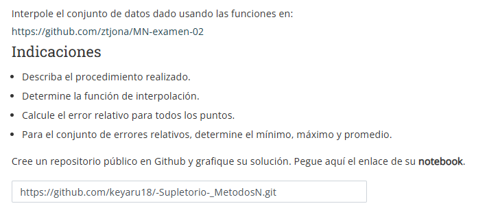
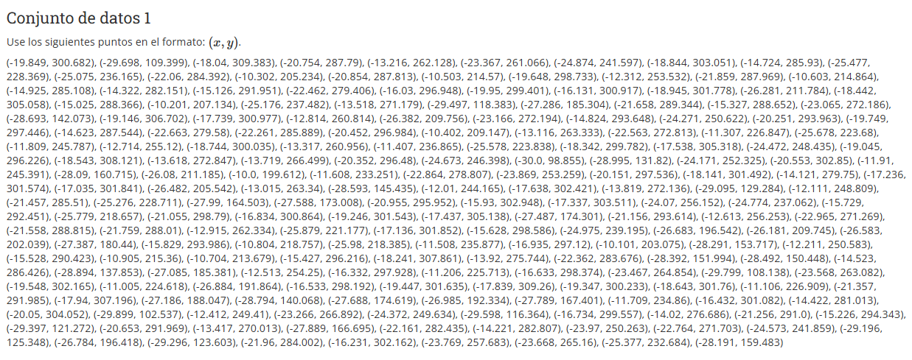
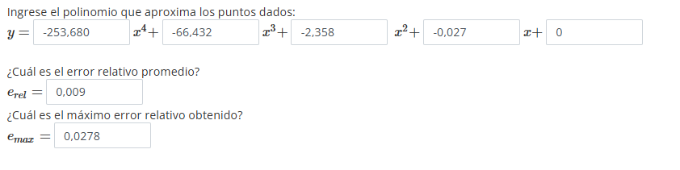
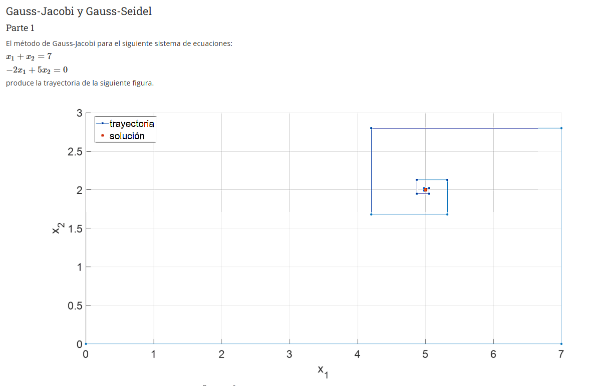
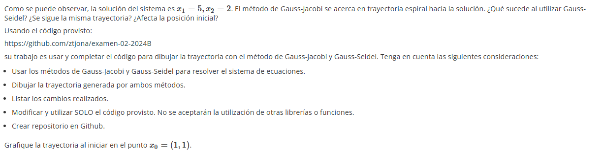
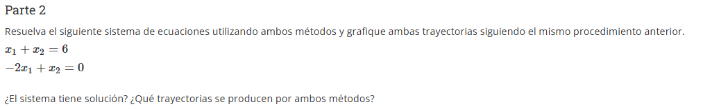
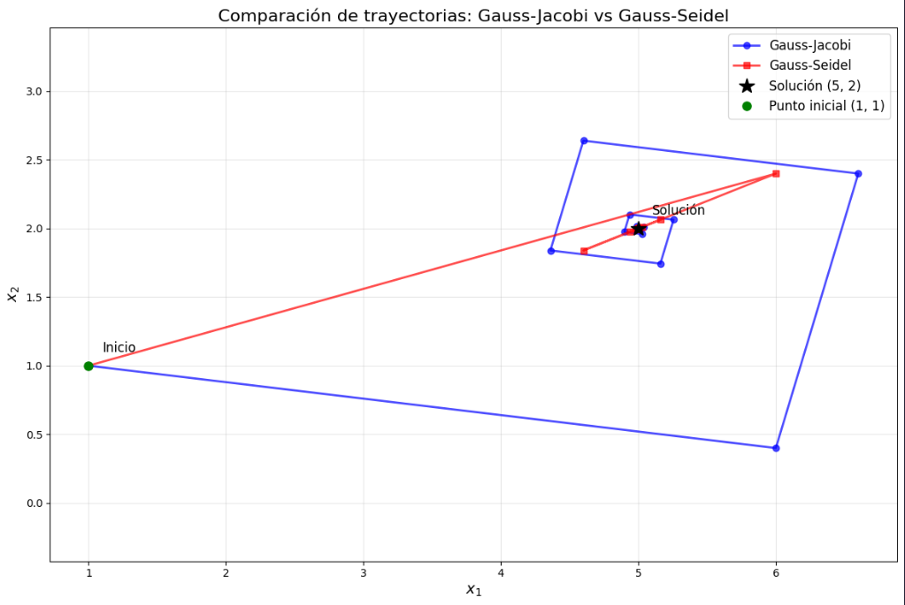
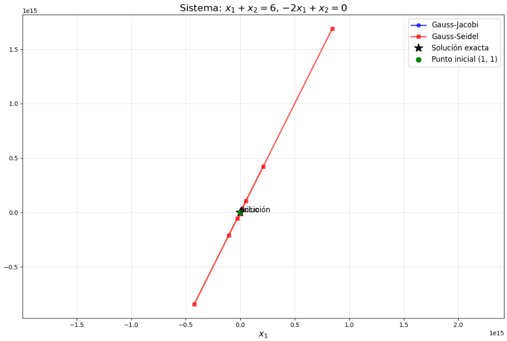

# -Supletorio-_MetodosN
---
## PREGUNTA 3


 ```python
import numpy as np
from scipy.optimize import bisect, newton

# Definir la función
def f(x):
    return x**5 -34.5 * x**4 + 384.5 * x**3 - 1559 * x**2 +2646 * x - 1612

# Definir la derivada para el método de Newton
def df(x):
    return 5*x**4 - 138.0*x**3 + 1153.5*x**2 - 3118*x + 2646

# Intervalos iniciales para el método de bisección basados en un gráfico aproximado
intervals = [(-4, -3), (-2.5, -1.5), (-1, 0), (0, 1), (1, 2), (2, 3)]

# Encontrar raíces usando bisección y Newton
roots = []
for a, b in intervals:
    try:
        root = bisect(f, a, b)
        roots.append(root)
    except ValueError:
        # Si bisección falla, intentar Newton con un punto inicial en el intervalo
        root = newton(f, (a + b)/2, df)
        roots.append(root)

# Ordenar y redondear las raíces
roots = sorted(np.round(roots, 3))

# Mostrar resultados
for i, root in enumerate(roots, 1):
    print(f"x{i} = {root}")
 ```

 ---

# PREGUNTA 4





```python


datos = [(-19.849, 300.682), (-29.698, 109.399), (-18.04, 309.383), (-20.754, 287.79), (-13.216, 262.128), (-23.367, 261.066), (-24.874, 241.597), (-18.844, 303.051), (-14.724, 285.93), (-25.477, 228.369), (-25.075, 236.165), (-22.06, 284.392), (-10.302, 205.234), (-20.854, 287.813), (-10.503, 214.57), (-19.648, 298.733), (-12.312, 253.532), (-21.859, 287.969), (-10.603, 214.864), (-14.925, 285.108), (-14.322, 282.151), (-15.126, 291.951), (-22.462, 279.406), (-16.03, 296.948), (-19.95, 299.401), (-16.131, 300.917), (-18.945, 301.778), (-26.281, 211.784), (-18.442, 305.058), (-15.025, 288.366), (-10.201, 207.134), (-25.176, 237.482), (-13.518, 271.179), (-29.497, 118.383), (-27.286, 185.304), (-21.658, 289.344), (-15.327, 288.652), (-23.065, 272.186), (-28.693, 142.073), (-19.146, 306.702), (-17.739, 300.977), (-12.814, 260.814), (-26.382, 209.756), (-23.166, 272.194), (-14.824, 293.648), (-24.271, 250.622), (-20.251, 293.963), (-19.749, 297.446), (-14.623, 287.544), (-22.663, 279.58), (-22.261, 285.889), (-20.452, 296.984), (-10.402, 209.147), (-13.116, 263.333), (-22.563, 272.813), (-11.307, 226.847), (-25.678, 223.68), (-11.809, 245.787), (-12.714, 255.12), (-18.744, 300.035), (-13.317, 260.956), (-11.407, 236.865), (-25.578, 223.838), (-18.342, 299.782), (-17.538, 305.318), (-24.472, 248.435), (-19.045, 296.226), (-18.543, 308.121), (-13.618, 272.847), (-13.719, 266.499), (-20.352, 296.48), (-24.673, 246.398), (-30.0, 98.855), (-28.995, 131.82), (-24.171, 252.325), (-20.553, 302.85), (-11.91, 245.391), (-28.09, 160.715), (-26.08, 211.185), (-10.0, 199.612), (-11.608, 233.251), (-22.864, 278.807), (-23.869, 253.259), (-20.151, 297.536), (-18.141, 301.492), (-14.121, 279.75), (-17.236, 301.574), (-17.035, 301.841), (-26.482, 205.542), (-13.015, 263.34), (-28.593, 145.435), (-12.01, 244.165), (-17.638, 302.421), (-13.819, 272.136), (-29.095, 129.284), (-12.111, 248.809), (-21.457, 285.51), (-25.276, 228.711), (-27.99, 164.503), (-27.588, 173.008), (-20.955, 295.952), (-15.93, 302.948), (-17.337, 303.511), (-24.07, 256.152), (-24.774, 237.062), (-15.729, 292.451), (-25.779, 218.657), (-21.055, 298.79), (-16.834, 300.864), (-19.246, 301.543), (-17.437, 305.138), (-27.487, 174.301), (-21.156, 293.614), (-12.613, 256.253), (-22.965, 271.269), (-21.558, 288.815), (-21.759, 288.01), (-12.915, 262.334), (-25.879, 221.177), (-17.136, 301.852), (-15.628, 298.586), (-24.975, 239.195), (-26.683, 196.542), (-26.181, 209.745), (-26.583, 202.039), (-27.387, 180.44), (-15.829, 293.986), (-10.804, 218.757), (-25.98, 218.385), (-11.508, 235.877), (-16.935, 297.12), (-10.101, 203.075), (-28.291, 153.717), (-12.211, 250.583), (-15.528, 290.423), (-10.905, 215.36), (-10.704, 213.679), (-15.427, 296.216), (-18.241, 307.861), (-13.92, 275.744), (-22.362, 283.676), (-28.392, 151.994), (-28.492, 150.448), (-14.523, 286.426), (-28.894, 137.853), (-27.085, 185.381), (-12.513, 254.25), (-16.332, 297.928), (-11.206, 225.713), (-16.633, 298.374), (-23.467, 264.854), (-29.799, 108.138), (-23.568, 263.082), (-19.548, 302.165), (-11.005, 224.618), (-26.884, 191.864), (-16.533, 298.192), (-19.447, 301.635), (-17.839, 309.26), (-19.347, 300.233), (-18.643, 301.76), (-11.106, 226.909), (-21.357, 291.985), (-17.94, 307.196), (-27.186, 188.047), (-28.794, 140.068), (-27.688, 174.619), (-26.985, 192.334), (-27.789, 167.401), (-11.709, 234.86), (-16.432, 301.082), (-14.422, 281.013), (-20.05, 304.052), (-29.899, 102.537), (-12.412, 249.41), (-23.266, 266.892), (-24.372, 249.634), (-29.598, 116.364), (-16.734, 299.557), (-14.02, 276.686), (-21.256, 291.0), (-15.226, 294.343), (-29.397, 121.272), (-20.653, 291.969), (-13.417, 270.013), (-27.889, 166.695), (-22.161, 282.435), (-14.221, 282.807), (-23.97, 250.263), (-22.764, 271.703), (-24.573, 241.859), (-29.196, 125.348), (-26.784, 196.418), (-29.296, 123.603), (-21.96, 284.002), (-16.231, 302.162), (-23.769, 257.683), (-23.668, 265.16), (-25.377, 232.684), (-28.191, 159.483)]

```

```python
from src.min_cuadrados import ajustar_min_cuadrados

xs = [p[0] for p in datos]
ys = [p[1] for p in datos]

sol = ajustar_min_cuadrados(xs, ys, [der_parcial_1, der_parcial_0])
print("Parámetros ajustados (a1, a0):", sol)

```

````python
def der_parcial_polinomial(xs, ys, grado):

    n = len(xs)
    m = grado + 1
    A = [[0.0 for _ in range(m)] for _ in range(m)]
    b = [0.0 for _ in range(m)]
    
    for i in range(m):
        for j in range(m):
            A[i][j] = sum(x**(i + j) for x in xs)  
        b[i] = sum(y * (x**i) for x, y in zip(xs, ys)) 
    
    return A, b
```

````python
import numpy as np

def ajustar_polinomio(xs, ys, grado=4):

    A, b = der_parcial_polinomial(xs, ys, grado)
    coeficientes = np.linalg.solve(A, b) 
    return coeficientes
```

```python
def calcular_errores_relativos(xs, ys, coeficientes):

    errores = []
    y_pred = np.polyval(coeficientes[::-1], xs)  
    
    for y_real, y_est in zip(ys, y_pred):
        if y_real == 0:
            errores.append(0)  
        else:
            errores.append(abs(y_real - y_est) / abs(y_real))
    
    return errores
```

```python
import numpy as np

# Datos
xs = [p[0] for p in datos]
ys = [p[1] for p in datos]

# 1. Ajustar polinomio de grado 4
coeficientes = np.polyfit(xs, ys, deg=4)[::-1]  # Invertir para orden descendente
print(f"Polinomio ajustado: y = {coeficientes[0]:.3f}x^4 + {coeficientes[1]:.3f}x^3 + {coeficientes[2]:.3f}x^2 + {coeficientes[3]:.3f}x + {coeficientes[4]:.3f}")

# 2. Calcular errores relativos
y_pred = np.polyval(coeficientes[::-1], xs)  # Evaluar polinomio
errores = np.abs((np.array(ys) - y_pred) / np.array(ys))
e_rel_promedio = np.mean(errores)
e_max = np.max(errores)
indice_max_error = np.argmax(errores)

print(f"Error relativo promedio: {e_rel_promedio:.4f}")
print(f"Máximo error relativo: {e_max:.4f}")
print(f"Punto con máximo error: (x={xs[indice_max_error]}, y={ys[indice_max_error]})")
```
````




---

## PREGUNTA 6




- **PARTE 1**

```python
def track_trajectory(method_func, A, b, x0, tol, max_iter):
    """
    Función wrapper para trackear la trayectoria del método iterativo
    """
    # Hacemos una copia para no modificar el original
    A = A.copy()
    b = b.copy()
    x0 = x0.copy()
    
    # Lista para almacenar la trayectoria
    trajectory = [x0.copy()]
    
    # Función temporal que registra cada iteración
    def logged_method(A, b, x0, tol, max_iter):
        n = A.shape[0]
        x = x0.copy()
        
        for k in range(1, max_iter):
            x_new = np.zeros((n, 1))
            for i in range(n):
                if method_func.__name__ == 'gauss_jacobi':
                    suma = sum([A[i, j] * x[j] for j in range(n) if j != i])
                else:  # gauss_seidel
                    suma1 = sum([A[i, j] * x_new[j] for j in range(i)])
                    suma2 = sum([A[i, j] * x[j] for j in range(i + 1, n)])
                    suma = suma1 + suma2
                
                x_new[i] = (b[i] - suma) / A[i, i]
            
            trajectory.append(x_new.copy())
            
            if np.linalg.norm(x_new - x) < tol:
                return x_new, trajectory
                
            x = x_new.copy()
        
        return x, trajectory
    
    # Ejecutar el método con tracking
    solution, full_trajectory = logged_method(A, b, x0, tol, max_iter)
    return np.array(full_trajectory).squeeze(), solution
```

````python
# Sistema de ecuaciones: x1 + x2 = 7, -2x1 + 5x2 = 0
A = np.array([[1, 1], 
              [-2, 5]], dtype=float)

b = np.array([7, 0], dtype=float).reshape(-1, 1)

# Punto inicial x0 = (1, 1)
x0 = np.array([1, 1], dtype=float).reshape(-1, 1)

# Parámetros de iteración
tol = 1e-6
max_iter = 50
```

````python
# Obtener trayectorias usando las funciones importadas
trajectory_jacobi, sol_jacobi = track_trajectory(gauss_jacobi, A, b, x0, tol, max_iter)
trajectory_seidel, sol_seidel = track_trajectory(gauss_seidel, A, b, x0, tol, max_iter)

print("Solución Gauss-Jacobi:", sol_jacobi.flatten())
print("Solución Gauss-Seidel:", sol_seidel.flatten())
```

```python
# Crear figura
plt.figure(figsize=(12, 8))

# Trayectoria Gauss-Jacobi
plt.plot(trajectory_jacobi[:, 0], trajectory_jacobi[:, 1], 
         'o-', linewidth=2, markersize=6, label='Gauss-Jacobi', color='blue', alpha=0.7)

# Trayectoria Gauss-Seidel
plt.plot(trajectory_seidel[:, 0], trajectory_seidel[:, 1], 
         's-', linewidth=2, markersize=6, label='Gauss-Seidel', color='red', alpha=0.7)

# Punto solución
plt.plot(5, 2, 'k*', markersize=15, label='Solución (5, 2)')

# Punto inicial
plt.plot(x0[0], x0[1], 'go', markersize=8, label='Punto inicial (1, 1)')

# Configuración del gráfico
plt.xlabel('$x_1$', fontsize=14)
plt.ylabel('$x_2$', fontsize=14)
plt.title('Comparación de trayectorias: Gauss-Jacobi vs Gauss-Seidel', fontsize=16)
plt.grid(True, alpha=0.3)
plt.legend(fontsize=12)
plt.axis('equal')

# Anotaciones
plt.text(5.1, 2.1, 'Solución', fontsize=12)
plt.text(1.1, 1.1, 'Inicio', fontsize=12)

plt.tight_layout()
plt.show()
````

- **PARTE 2**



```python
# Resolver el sistema: x1 + x2 = 6, -2x1 + x2 = 0
A = np.array([[1, 1], 
              [-2, 1]], dtype=float)

b = np.array([6, 0], dtype=float).reshape(-1, 1)

# Punto inicial (puedes usar el mismo o cambiar)
x0 = np.array([1, 1], dtype=float).reshape(-1, 1)

# Parámetros de iteración
tol = 1e-6
max_iter = 50

```


````python
# Obtener trayectorias para el nuevo sistema
trajectory_jacobi2, sol_jacobi2 = track_trajectory(gauss_jacobi, A, b, x0, tol, max_iter)
trajectory_seidel2, sol_seidel2 = track_trajectory(gauss_seidel, A, b, x0, tol, max_iter)

print("Solución Gauss-Jacobi:", sol_jacobi2.flatten())
print("Solución Gauss-Seidel:", sol_seidel2.flatten())
```

````python
# Verificar si el sistema tiene solución única
det_A = np.linalg.det(A)
print(f"\nDeterminante de A: {det_A}")

if det_A != 0:
    sol_exacta = np.linalg.solve(A, b)
    print(f"Solución exacta: {sol_exacta.flatten()}")
else:
    print("El sistema no tiene solución única")

# Crear figura para el nuevo sistema
plt.figure(figsize=(12, 8))

# Trayectoria Gauss-Jacobi
plt.plot(trajectory_jacobi2[:, 0], trajectory_jacobi2[:, 1], 
         'o-', linewidth=2, markersize=6, label='Gauss-Jacobi', color='blue', alpha=0.7)

# Trayectoria Gauss-Seidel
plt.plot(trajectory_seidel2[:, 0], trajectory_seidel2[:, 1], 
         's-', linewidth=2, markersize=6, label='Gauss-Seidel', color='red', alpha=0.7)

# Punto solución (si existe)
if det_A != 0:
    plt.plot(sol_exacta[0], sol_exacta[1], 'k*', markersize=15, label='Solución exacta')

# Punto inicial
plt.plot(x0[0], x0[1], 'go', markersize=8, label='Punto inicial (1, 1)')

# Configuración del gráfico
plt.xlabel('$x_1$', fontsize=14)
plt.ylabel('$x_2$', fontsize=14)
plt.title('Sistema: $x_1 + x_2 = 6$, $-2x_1 + x_2 = 0$', fontsize=16)
plt.grid(True, alpha=0.3)
plt.legend(fontsize=12)
plt.axis('equal')

# Anotaciones
plt.text(x0[0] + 0.1, x0[1] + 0.1, 'Inicio', fontsize=12)
if det_A != 0:
    plt.text(sol_exacta[0] + 0.1, sol_exacta[1] + 0.1, 'Solución', fontsize=12)

plt.tight_layout()
plt.show()
````
````


- Gráfico de la parte 1 al modificar estimación inicial


- Gráfico de la parte 2



- Comentarios finales
    - Al parecer los dos métodos divergen aunque gauss_seidel lo hace aun más  y me parece que esto es porque la matriz no es diagonalmente dominante.
    - Si hay solución pero con otros métodos.
